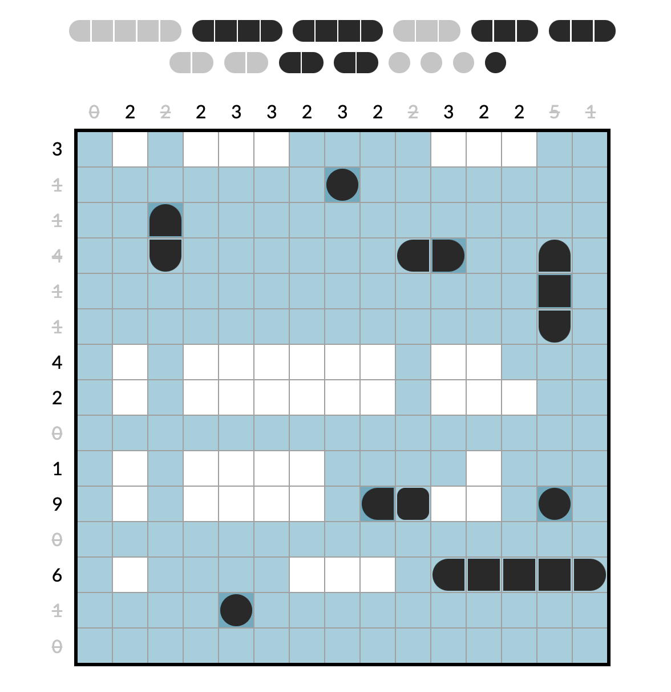

# Battleship Solitaire Solver

I'm a big fan of [Battleship Solitaire](https://lukerissacher.com/battleships).

<kbd></kbd>

The game is simple. You figure out where the battleships are. The numbers on the
edges tell you how many squares in each line are part of a ship. Ships can't
touch, not even diagonally.

The game reveals a few squares to get you going. Every puzzle has a unique
solution that can be arrived at logically from from the starting position.

## Usage

Install Bun, then run:

```bash
bun run build
```

This produces solve.js; paste that into your Chrome console. Then run one of the
install functions:

- `installSolveButton()` installs a Solve button in the toolbar
- `installAutoSolve()` installs auto-solve, which solves on every click

## The Solver

This is more an assistant than a solver. It's possible (and not that hard) to
write a full solver, but the goal of this tool instead is to change the
character of the game.

The game has easy and hard puzzles. Easy puzzles can be autosolved by repeatedly
applying a few rules:

- If a line has used up its ship squares, the rest must be water
- If a line has used up its non-ship squares, the rest must be ship
- If there's a ship square, its corners must be water
- If there's a completed ship, its perimeter must be water
- If there's only one place a ship can go, it has to go there (e.g. if you have
  a 5-ship, and there's only one remaining 5-slot)

For hard puzzles, applying the rules isn't enough. You end up getting stuck.
Then you have to play the "macro" game of enumerating the possible ship
configurations, exploring each possible path, and backtracking if it deadends.
Within each path exploration you play the "micro" game of repeatedly applying
the simple rules and seeing if it leads to an invalid result.

Right now you spend a bunch of time on the tedious but not particularly
challenging/interesting micro game. This automates the micro so you can focus on
the macro.

In a way I was inspired by Braid, a platformer that lets you rewind time instead
of dying, so that the game becomes about the higher-level puzzle rather than
mechanically trying not to fall or get killed.
